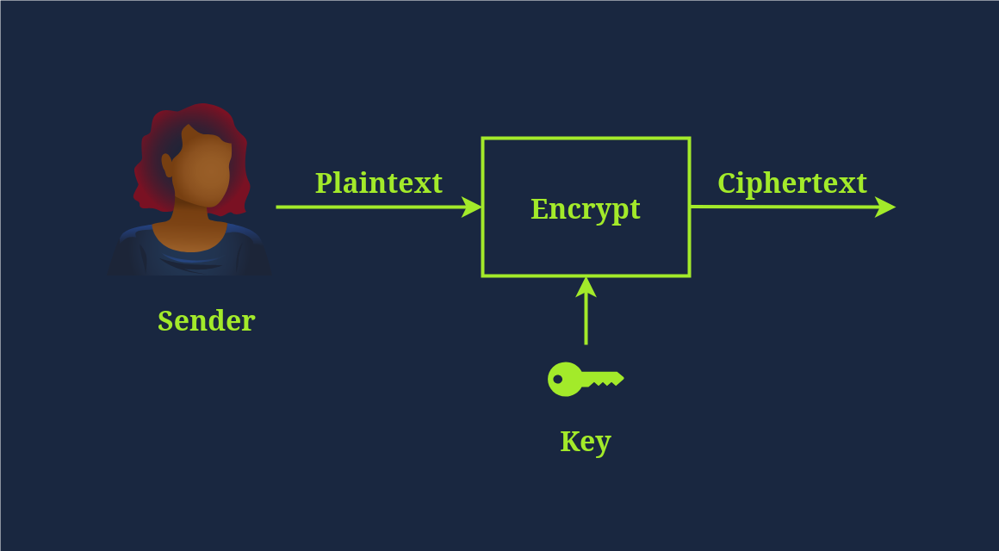
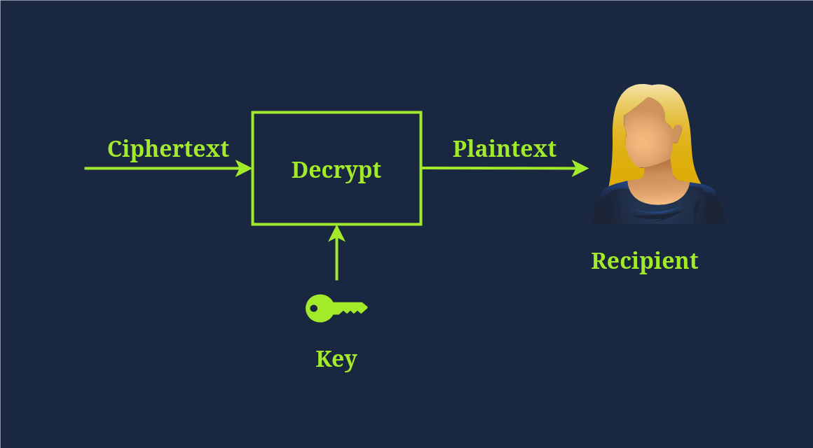
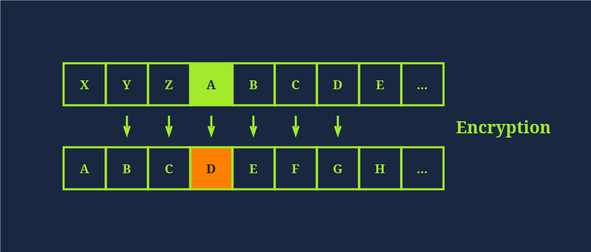
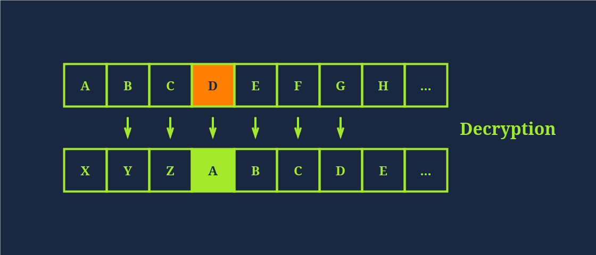
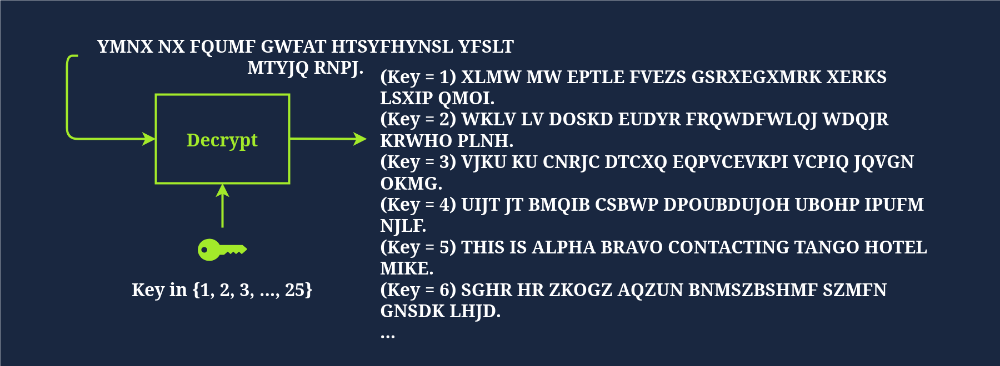
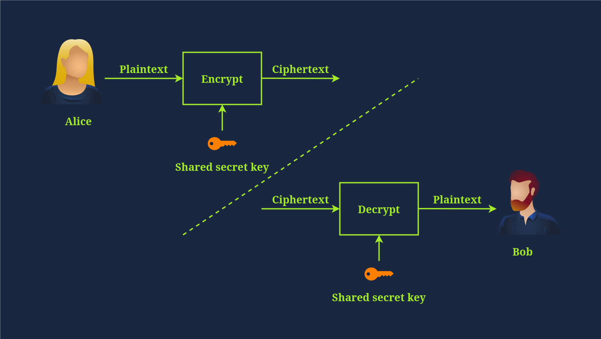
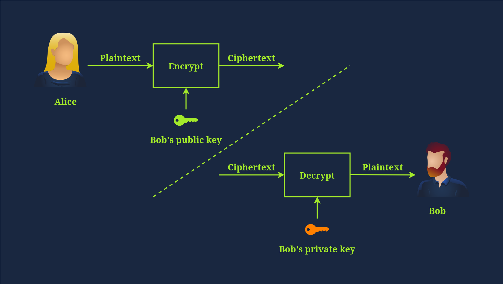

# CryptoGraphy Basics

- Konačna svrha kriptografije je osigurati sigurnu komunikaciju u prisutnosti protivnika
- Pojam siguran uključuje povjerljivost i integritet prenesenih podataka
- Kriptografija se može definirati kao praksa i proučavanje tehnika za sigurnu komunikaciju i zaštitu podataka gdje očekujemo prisutnost protivnika i trećih strana

## Plaintext to Ciphertext

- Plain text - izvorna, čitljiva poruka ili podaci prije nego što se enkriptiraju
- Ciphertext - šifrirana, nečitljiva verzija poruke nakon enkripcije
- Cipher - algoritam ili metoda za pretvaranje otvorenog teksta u šifrirani tekst i natrag. Šifru obično razvija matematičar
- Key - niz bitova koje šifra koristi za šifriranje ili dešifriranje podataka. Općenito, korištena šifra je javno poznata; međutim, ključ mora ostati tajan, osim ako nije javni ključ u asimetričnoj enkripciji
- Encryption - proces pretvaranja otvorenog teksta u šifrirani tekst pomoću šifre i ključa
- Decryption - obrnuti proces šifriranja, pri čemu se šifrirani tekst pretvara natrag u otvoreni tekst pomoću šifre i ključa

## Historical Cyphers

- Povijest kriptografije je duga i seže do drevnog Egipta, 1900. pr. Kr. 
- Međutim, jedna od najjednostavnijih povijesnih šifri je Cezarova šifra iz prvog stoljeća pr. Kr.

- Caesar Cipher pomiče svako slovo za određeni broj kako bi dešifrirao poruku
- Za enkripciju, pomičemo se udesno za tri; Za dešifriranje, pomičemo se ulijevo za tri i vraćamo izvorni otvoreni tekst, kao što je prikazano na gornjoj slici

- Slika iznad prikazuje kako će dešifriranje uspjeti pokušajem svih mogućih ključeva; u tom slučaju vratili smo izvornu poruku s Ključem = 5 

## Types of Encryption

### Symmetric Encryption

- Simetrična enkripcija, poznata i kao simetrična kriptografija, koristi isti ključ za šifriranje i dešifriranje podataka
- Čuvanje ključa u tajnosti je nužno
- Problem postaje ozbiljniji u prisutnosti moćnog protivnika

- DES (Data Encryption Standard)- usvojen kao standard 1977. godine i koristi 56-bitni ključ, 
- 3DES - primjenjuje tri puta; posljedično, veličina ključa je 168 bita, iako je efektivna sigurnost 112 bita, 3DES je ukinut 2019. i trebao bi biti zamijenjen AES-om
- AES (Advanced Encryption Standard)- svojen kao standard 2001. godine. Veličina ključa može biti 128, 192 ili 256 bita

### Asymmetric Encryption

- asimetrična enkripcija koristi par ključeva, jedan za šifriranje, a drugi za dešifriranje, kao što je prikazano na ilustraciji ispod

- Primjeri su RSA, Diffie-Hellmanova i eliptična kriptografija (ECC). Dva ključa uključena u proces nazivaju se javni ključ i privatni ključ
- Asimetrična enkripcija obično je sporija, a mnoge asimetrične šifre koriste veće ključeve od simetrične enkripcije
- Asimetrična enkripcija temelji se na određenoj skupini matematičkih problema koje je lako izračunati u jednom smjeru, ali ih je izuzetno teško poništiti

## Math

- Modulo - podijelim jedan broj s drugim i ostane nam ostatak ako nije lijep broj
- XOR - kada pomnozimo 0*0 ili 1*1 uvijek ćemo dobiti 0, ako množimo 0*1 ili 1*0 dobit cemo 1
